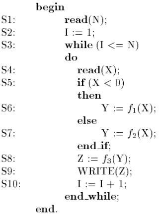
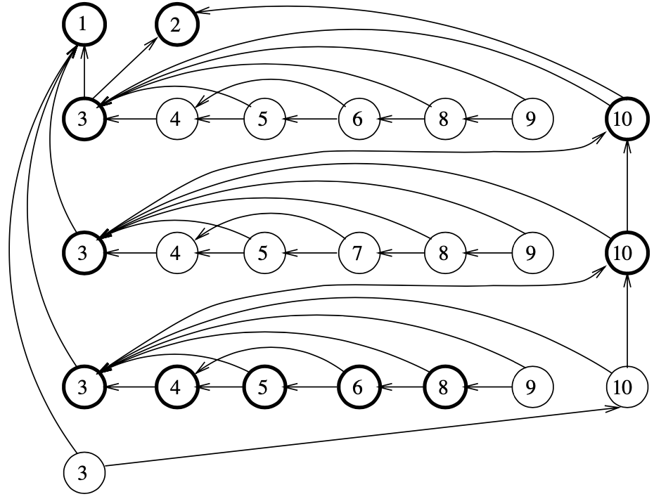

# Dynamic Program Slicing
This is a Russian translation (excerpts) of an article by Hiralal Agrawal and Joseph Robert Horgan titled «Dynamic Program Slicing», published in 1990 in `PLDI '90: Proceedings of the ACM SIGPLAN 1990 conference on Programming language design and implementation, Pages 246–256`. All rights belong to the authors of the article and relevant organizations. [DOI 10.1145/93542.93576](https://dl.acm.org/doi/10.1145/93542.93576)

# Динамический слайсинг программ

## Введение
**Program slicing (срезание программ; слайсинг)** — нахождение всех инструкций (операторов, выражений) в программе, которые прямо или косвенно влияют на значение переменной в некотором месте программы.

Выбранные с помощью слайсинга инструкции составляют **slice (срез; слайс)**. Срез определяется по отношению к некоторому **критерию среза (slicing criteria)**, который обычно задаётся парой \[точка программы, множество переменных\]. Срез должен вычислять выбранные переменные точно так же, как исходная программа.

Одно из применений слайсинга — отладка (debugging): если значение переменной некорректно в некоторой точке программы, слайсинг позволяет упростить поиск причины ошибки.

Описанный вариант слайсинга никак не учитывает конкретные входные данные, которые привели к ошибке — будут найдены не только те инструкции, которые действительно повлияли на значение выбранной переменной, но и все те, которые потенциально могли на него повлиять. Это называется **static program slicing (статический слайсинг)**.

Чем меньше слайс относительно исходной программы, тем он полезнее, поэтому вводится понятие **dynamic program slicing (динамический слайсинг)** — слайсинг с учётом конкретных входных данных и поиском инструкций, которые реально повлияли на значение выбранной переменной.
## Граф зависимостей программы и статический слайсинг
**Program dependence graph (граф зависимостей программы)** имеет по узлу на каждую простую инструкцию (присваивание, чтение, запись и т. д.) и по узлу на каждое выражение-условие (условия внутри if-else, while-do и т. д.). Также имеет два типа рёбер — рёбра зависимости по данным и рёбра зависимости по управлению.

**Ребро зависимости по данным (data-dependence edge)** из вершины $v_i$ в вершину $v_j$ означает, что вычисление в вершине $v_i$ использует некоторую переменную `var`, значение которой определено в вершине $v_j$ и существует путь исполнения программы из $v_j$ в $v_i$, на котором `var` не изменяется.

**Ребро зависимости по управлению (control-dependence edge)** из вершины $v_i$ в вершину $v_j$ означает, что вычисление в вершине $v_i$ может быть исполнено или не исполнено в зависимости от значения предиката (логического выражения) в вершине $v_j$.

---

В примере на рисунке ниже рёбра зависимости по данным обозначены сплошными линиями, а рёбра зависимости по управлению — прерывистыми.

|  |  |
| ------------------------ | ---------------------------- |
| Программа 1              | PDG программы 1              |

Для нахождения статического слайса по переменной `var` в точке *n* необходимо найти все узлы, доступные из *n* и влияющие на значение `var` (**достигающие определения** или **reaching definitions**), затем обойти граф из этих узлов — посещённые узлы будут составлять искомый слайс.

В примере выше найдём слайс из точки 10 по переменной `Y`. Узлы, доступные из точки 10 и влияющие на значение `Y` — 3, 6 и 8. Дальнейший обход графа даёт множество *{1, 2, 3, 4, 5, 8}*, которое и составляет искомый слайс.
## Динамический слайсинг
Обозначим как последовательность $< v_1,v_2,...,v_n>$ вершин графа зависимостей программы **историю выполнения программы** для конкретных входных данных. Вершины расположены в порядке, в котором они исполняются. Верхние индексы позволяют разделять несколько вхождений одной и той же вершины. История выполнения: $<1,2,3,4,5^1,6^1,7^1,8^1,5^2,9>$ для программы ниже при `N = 2`:

|  |
| ------------------------ |
| Программа 2              |

В отличие от статического слайсинга, который определяется по отношению к определённой точке программы, динамический слайсинг определяется по отношению к точке в истории выполнения программы.
### Динамический слайсинг, подход первый.

> 1️⃣ Наивный подход: во время исполнения необходимо помечать все пройденные узлы на графе зависимостей программы, затем применить только к пройденным узлам алгоритм статического слайсинга.

---

Для программы 1 при `X = -1` слайс по переменной `Y` на конец выполнения программы выглядит следующим образом:

|  |
| ---------------------------------- |
| Слайс программы 1 на PDG           |

Сначала все узлы нарисованы пунктиром. Затем сплошной линией выделены узлы, посещённые при выполнении программы. Затем жирной линией выделены узлы, входящие в слайс.

---

Для программы 2 при `N = 1` слайс по переменной `Z` на конец выполнения программы выглядит следующим образом:

|  |
| --------------------------------------------- |
| Слайс программы 2, полученный первым подходом |

Этот слайс включает в себя узел 7, который никак не влияет на значение переменной `Z`. Узел 9 зависит от узла 6, который имеет зависимость по данным на узел 7, поэтому узел 7 попал в слайс.

Таким образом, этот подход может включать в слайсы лишние инструкции, которые не влияют на значение заданной переменной.
### Динамический слайсинг, подход второй
Проблемы с первым подходом возникают из-за того, что один узел может иметь несколько достигающих определений одной и той же переменной, следовательно, иметь несколько исходящих рёбер зависимости по данным. Если узел выполнится, все эти определения попадут в слайс, даже если они не повлияли на этот узел в процессе исполнения.

Узел имеет несколько достигающих определений, если есть несколько путей исполнения, приходящих к этому узлу. Но каждый отдельный путь содержит не более одного достигающего определения для любой переменной в любой точке программы.

> 2️⃣ Второй подход: отмечать рёбра графа зависимостей программы, когда соответствующая зависимость используется, затем обойти граф только по отмеченным рёбрам.

Доказано, что для программ, не имеющих циклов, этот подход всегда даст точный динамический слайс. При наличии циклов слайс может включать лишние инструкции.

---

Для программы 2 при `N = 1` слайс по переменной `Z` на конец выполнения программы выглядит следующим образом:

|  |
| ---------------------------------------------- |
| Слайс программы 2, полученный вторым подходом  |

Сначала все рёбра нарисованы пунктиром. Затем сплошной линией выделены рёбра зависимостей, использованных при выполнении программы. Затем жирным выделены узлы, входящие в слайс.

---

Рассмотрим слайс для программы 3 при `N = 2` и значениях `X = -4` и `X = 3` по переменной `Z` для точки $9^2$ (точка 9 на второй итерации цикла). 

История выполнения следующая: $<1,2,3^1,4^1,5^1,6,8^1,9^1,10^1,3^2,4^2,5^2,7,8^2,9^2>$. На первой итерации цикла выполнится `then`-часть конструкции `if` (точка 6), на второй — `else` (точка 7). Узлы 6 и 7 будут включены в слайс в соотвествии со вторым подходом, хотя значение `Z` на конец выполнения программы (точка $9^2$) зависит только от узла 7.

На рисунке ниже приведён фрагмент графа зависимостей программы после применения второго подхода:

|  |         |
| ------------------------ | ------------------------------------------------------- |
| Программа 3              | Фрагмент слайса программы 3, полученный вторым подходом |

### Динамический слайсинг, подход третий
Проблемы со вторым подходом возникают из-за того, что одна инструкция может встречаться в истории выполнения программы несколько раз, и при этом иметь разные достигающие определения одной и той же переменной. Граф зависимостей программы не позволяет различить разные вхождения.

> 3️⃣ Третий подход: создавать узлы для каждого вхождения инструкции в истории выполнения с исходящими рёбрами зависимости только к тем инструкциям (конкретным их вхождениям), от которых данное вхождение действительно зависит. Каждый узел в таком графе будет иметь не более одного исходящего узла для каждой переменной, используемой в инструкции. Такой граф называется **граф динамических зависимостей (dynamic dependence graph)**.

---

Рассмотрим граф динамических зависимостей для программы 3 при `N = 3` и значениях `X = -4`, `X = 3` и `X = -2`. 

История: $<1, 2, 3^1, 4^1, 5^1, 6^1, 8^1, 9^1, 10^1, 3^2, 4^2, 5^2, 7^1, 8^2, 9^2, 10^2, 3^3, 4^3, 5^3, 6^2, 8^3, 9^3, 10^3, 3^4>$. Три ряда узлов на рисунке — три итерации цикла. Можно видеть, что узел 8 на разных итерациях цикла зависит от разных узлов.

Чтобы из графа динамических зависимостей получить слайс, необходимо найти последний узел, в котором объявляется нужная переменная, затем обойти граф из этого узла.

На рисунке представлен слайс по переменной `Z` на конец выполнения программы. Последний узел, в котором объявляется переменная `Z` — узел 8 в последней итерации цикла. Если обойти граф из него, будет получен искомый слайс (узлы выделены жирным на рисунке).

|   |
| ---------------------------------------------- |
| Слайс программы 3, полученный третьим подходом |
### Динамический слайсинг, подход четвёртый
Проблема третьего подхода заключается в том, что размер графа динамических зависимостей (количество узлов и рёбер) в общем случае неограничен. С другой стороны, количество динамических слайсов ограничено, так как каждый слайс представляет собой подмножество конечной программы. Это позволяет ограничить размер графа.

> 4️⃣ Четвёртый подход: вместо создания узла на каждое вхождение инструкции в историю выполнения, создавать узел следует только тогда, когда не существует другого узла с такими же транзитивными зависимостями. Такой граф называется **сокращённый граф динамических зависимостей (reduced dynamic dependency graph)**.

Для постройки такого графа необходимо вести две таблицы, $DefnNode$ и $PredNode$. $DefnNode$ сопоставляет имя переменной и узел, который последним изменял значение этой переменной. $PredNode$ сопоставляет выражения-условия (предикаты) и узел, содержащий последнее вхождение предиката в историю выполнения программы. Также с каждым узлом графа сопоставляется множество $ReachableStmts$, содержащее все инструкции, вхождений которых можно достичь из этого узла.

Каждый раз, когда инструкция $S_i$ исполняется, необходимо определить множество узлов $D$, которые последними присваивали значения переменным, используемым в $S_i$, а также последнее вхождение узла-предиката $C$, от которого зависит $S_i$. Если существует узел $n$ с инструкцией $S_i$ и непосредственные потомки которого составляют множество $D \cup C$, новое вхождение $S_i$ сопоставляется с узлом $n$. Иначе создаётся новый узел, с исходящими рёбрами во все узлы из множества $D \cup C$. Если в $S_i$ каким-либо переменным задаётся новое значение, обновляется таблица $DefnNode$. Если $S_i$ — предикат, обновляется таблица $PredNode$.

Такая схема работает тогда, когда нет циклических зависимостей в графе зависимостей программы. В случае циклов на каждую итерацию будет создаваться новый узел для одной и той же инструкции. Для решения этой проблемы перед созданием нового узла для инструкции $S_i$ необходимо проверять, имеет ли кто-то из его непосредственных потомков, например $v$, зависимость на предыдущее вхождение $S_i$ и доступны ли другие непосредственные потомки нового вхождения $S_i$ из узла $v$. Такая проверка выполняется путём проверки, является ли множество $ReachableStmts$ нового вхождения подмножеством $ReachableStmts$ для $v$. В случае успеха, можно объединить $S_i$ и $v$.

---

Рассмотрим сокращённый граф динамических зависимостей для программы 3 при `N = 3` и значениях `X = -4`, `X = 3` и `X = -2`.

История: $<1, 2, 3^1, 4^1, 5^1, 6^1, 8^1, 9^1, 10^1, 3^2, 4^2, 5^2, 7^1, 8^2, 9^2, 10^2, 3^3, 4^3, 5^3, 6^2, 8^3, 9^3, 10^3, 3^4>$. Рядом с каждым из узлов — множество инструкций, доступных из этого узла (те, из которых можно прийти в данный узел).

|           |
| ------------------------------------------------ |
| Слайс программы 3, полученный четвёртым подходом |

На этом графе только одно вхождение узла 10, кроме того, второе и третье появление узла 3 объединены с узлом 10. Второе вхождение узла 3 можно объединить с узлом 10, так как множество  $ReachableStmts$ второго вхождения узла 3 состоит из узлов $\{1,2,3,10\}$, что является подмножеством $ReachableStmts$ узла 10 (так же $\{1,2,3,10\}$). Третье вхождение узла 10 имеет непосредственными потомками узлы 10 и 1, которые также являются непосредственными потомками нового узла $(10,3)$, поэтому это вхождение можно объединить с узлом $(10,3)$.

Для получения слайса из этого графа необходимо найти вхождение переменной в таблице $DefnNode$, тогда множество $ReachableStmts$ для этого вхождения будет искомым слайсом. На рисунке выше динамический слайс по переменной `Z` состоит из множества $\{1,2,3,4,5,6,8,10\}$ (узел 8 на последней строке, так как это последний узел, изменяющий значение переменной `Z`).
